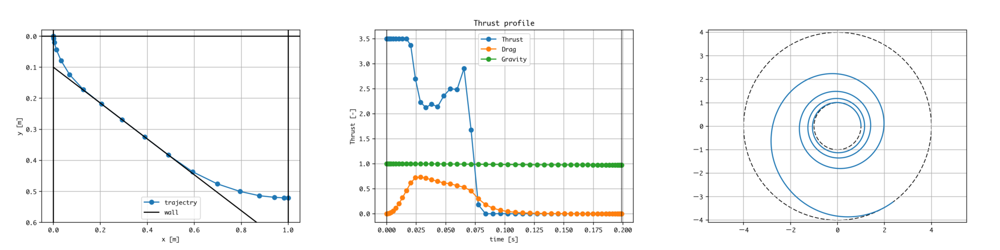

=================================================
OpenGoddard - Trajectory Optimization for Python
=================================================

OpenGoddard is a open source python library designed for solving general-purpose optimal control problems.
OpenGoddard is based on the pseudospectral optimal control theory.

What sort of problems does OpenGoddard solve?
=============================================
Generally speaking, it can adapt to open-loop nonlinear optimal control problems such as aerospace, robot, industry, energy, chemistry etc.
In the field of aerospace, for example, it is possible to generate the optimum trajectory of the spacecraft.

Examples
========

1. Brachistochrone problem
2. Goddard problem (optimal rocket ascent problem)
3. Launch vehicle trajectory optimization
4. Low thrust spacecraft trajectory transition problem

Features
========
* Easy to install
* Lots of examples
* Readable source code
* Adopt pseudospectral method
* Pseudospectral method of Legendre-Gauss-Lobatto
* Pseudospectral knotting-method
* Easy to scale variable
* use SLSQP(in scipy) for solving nonlinear programming problem (NLP)

Installation
============
::

  $ pip install OpenGoddard

Usage
=====
::

  from OpenGoddard.optimize import Problem, Guess, Condition, Dynamics

#. Make object that has methods and variables to optimize trajectory
#. Equation of motion
#. Constraint
#. Evaluation function
#. Instantiation of Problem class
#. Installation of an object class that optimizes trajectory
#. Set canonical unit of optimization variable (optional)
#. Guess initial values and set it (optional)
#. Set Problem.functions and knotting condition
#. Solve
#. Post process (visualization)

License
=======
OpenGoddard is an Open Source project licensed under the MIT License

----

==========================================================
OpenGoddard - 連続時間の非線形最適制御問題のためのpythonライブラリ
==========================================================

OpenGoddardはオープンソースな連続時間の非線形最適制御問題を解くpythonライブラリです。
数値解法としては擬スペクトル法を採用しています。

どんな問題が解けるか？
===================
一般的に、航空宇宙、ロボット、産業、エネルギー、化学などなどのオープンループな非線形最適制御問題に適応できます。
航空宇宙の分野では例えば、宇宙機の最適な軌道を生成することなどができます。

例
====

1. 最速降下問題
2. ゴダード問題（ロケットの最適上昇制御問題）
3. ロケットの最適軌道生成
4. 低推力軌道遷移問題

特徴
====
* 簡単なインストール - pythonのnumpy, scipy, matplotlibにしか依存していません。
* 複数の例題
* ソースコードの高い可読性
* 非線形最適制御を数値解法のうち、直接法の中の擬スペクトル法を採用
* Legendre-Gauss-Lobattoの擬スペクトル法
* pseudospectral knotting-method
* 簡易な変数スケーリング
* 非線形計画問題（NLP）を解くのはScipyの逐次二次計画法（SLSQP）

インストール
==========
::

  $ pip install OpenGoddard

使い方
=====
::

 from OpenGoddard.optimize import Problem, Guess, Condition, Dynamics

#. 軌道の最適化をする物体クラスのメソッドと変数の記述
#. 運動方程式の関数
#. 拘束条件の関数
#. 評価関数の関数
#. Problemインスタンス生成
#. 軌道の最適化をする物体インスタンスの生成
#. 最適化変数の正規化のための単位設定（任意）
#. 初期値の推定と設置（任意）
#. 関数の指定とknotting条件の指定
#. solve
#. ポストプロセス（可視化）

ライセンス
=========
OpenGoddardはMITライセンスのオープンソースプロジェクトです。

---------

References
==========
Fariba Fahroo and I. Michael Ross.  "Costate Estimation by a Legendre Pseudospectral Method", Journal of Guidance, Control, and Dynamics, Vol. 24, No. 2 (2001), pp. 270-277.
http://dx.doi.org/10.2514/2.4709

I. Michael Ross and Fariba Fahroo.  "Pseudospectral Knotting Methods for Solving Nonsmooth Optimal Control Problems", Journal of Guidance, Control, and Dynamics, Vol. 27, No. 3 (2004), pp. 397-405.
http://dx.doi.org/10.2514/1.3426

Qi Gong, Fariba Fahroo, and I. Michael Ross.  "Spectral Algorithm for Pseudospectral Methods in Optimal Control", Journal of Guidance, Control, and Dynamics, Vol. 31, No. 3 (2008), pp. 460-471.
http://dx.doi.org/10.2514/1.32908

Isaac Ross, Christopher D'Souza, Fariba Fahroo, and Jim Ross. "A Fast Approach to Multi-Stage Launch Vehicle Trajectory Optimization", AIAA Guidance, Navigation, and Control Conference and Exhibit, Guidance, Navigation, and Control and Co-located Conferences,
http://dx.doi.org/10.2514/6.2003-5639

Rea, Jeremy Ryan. A legendre pseudospectral method for rapid optimization of launch vehicle trajectories. Diss. Massachusetts Institute of Technology, 2001.
http://hdl.handle.net/1721.1/8608

Rao, Anil V., et al. "Algorithm 902: Gpops, a matlab software for solving multiple-phase optimal control problems using the gauss pseudospectral method." ACM Transactions on Mathematical Software (TOMS) 37.2 (2010): 22.
http://s3.amazonaws.com/researchcompendia_prod/articles/595f4b3cca056a0f35655cad73868234-2013-12-23-01-43-18/a22-rao.pdf

日本語で擬スペクトル法のことが記述されている文献
----------------------------------------

原田正範. "ヤコビ擬スペクトル法による最適化手法の重み関数の高精度計算法." 日本機械学会論文集 C 編 77.784 (2011): 4458-4467.
http://doi.org/10.1299/kikaic.77.4458

原田正範. "ヤコビ擬スペクトル法を用いた最適制御問題の解法における双対変数の推定." 計測自動制御学会論文集 49.8 (2013): 808-815.
http://doi.org/10.9746/sicetr.49.808

原田正範. "高次ガウス・ロバット則の重み関数を用いたヤコビ擬スペクトル法による軌道最適化." 日本機械学会論文集 C 編 73.728 (2007): 1075-1080.
http://doi.org/10.1299/kikaic.73.1075

藤川貴弘, 土屋武司, and 田口秀之. "観測ロケットを利用した極超音速飛行試験: 2 軌道検討." title 平成 24 年度宇宙輸送シンポジウム: 講演集録 Proceedings of Space Transportation Symposium: FY2012. 2013.
https://repository.exst.jaxa.jp/dspace/handle/a-is/14011
