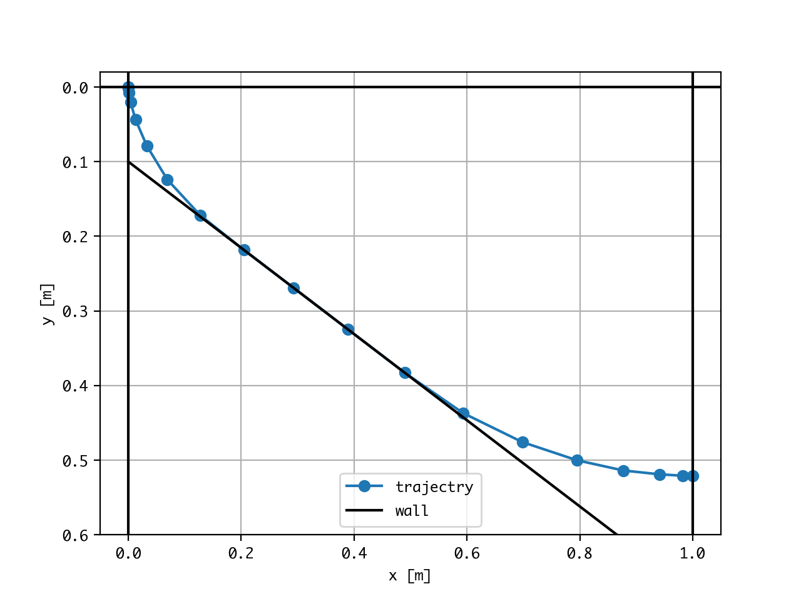
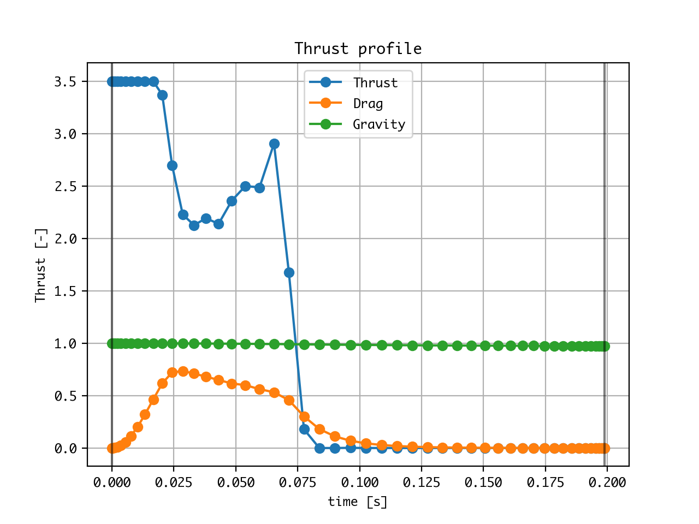

.. OpenGoddard documentation master file, created by
   sphinx-quickstart on Sun Mar  5 11:48:11 2017.
   You can adapt this file completely to your liking, but it should at least
   contain the root `toctree` directive.

OpenGoddard
===========

.. toctree::
   :maxdepth: 2
   :caption: Contents:

OpenGoddard_ is is a open source python library designed for solving
general-purpose optimal control problems.
OpenGoddard is based on the pseudospectral optimal control theory.

.. _OpenGoddard: https://github.com/istellartech/OpenGoddard

See examples_ in github repository.

.. _examples: https://github.com/istellartech/OpenGoddard/tree/master/examples

and, see module detail :ref:`modindex`

Example: Brachistochrone Problem with wall
------------------------------------------

Examples: Goddard Problem (Optimal ascent of a rocket through the atmosphere)
-----------------------------------------------------------------------------

Examples: Low Thrust Orbit Transfer
-----------------------------------

.. image:: images/LowThrustOrbitTransfer.png

----

Indices and tables
==================

* :ref:`genindex`
* :ref:`modindex`
* :ref:`search`
